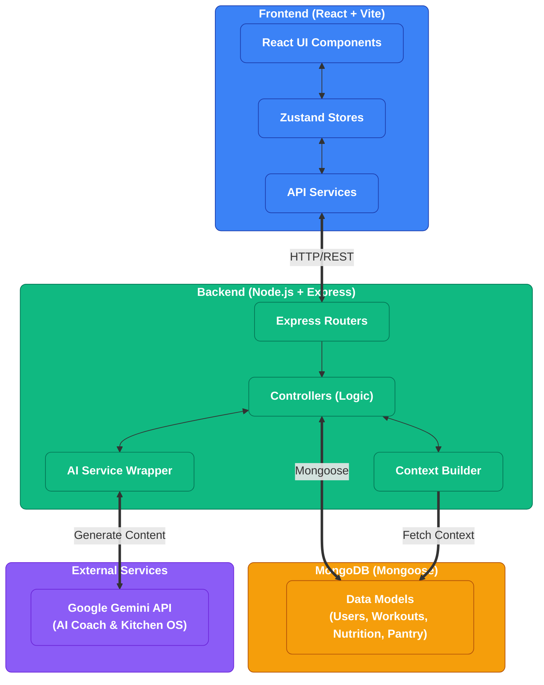

# Weight Coach

A modern, AI-powered fitness and nutrition tracking application with a clean, dynamic interface. Built with the MERN stack and integrated with Google's Gemini AI.

## Features

- **Context-Aware AI Coach**: Chat with an AI that understands your specific goals, workout history, and macro targets.
- **Kitchen OS**: Manage your pantry inventory and generate AI-driven meal suggestions based on what you have and your macro goals.
- **Set-Based Workouts**: Log detailed workouts (reps, weight, warmup/drop sets) using a dynamic, real-time table interface.
- **Nutrition Journal**: Track daily macros, log specific meals, and monitor water intake.
- **Health Dashboard**: Visualize trends for weight, body fat, and resting heart rate over time.

## Tech Stack

- **Frontend**: React, Vite, Tailwind CSS, Zustand, Recharts, Lucide Icons
- **Backend**: Node.js, Express, TypeScript, Zod
- **Database**: MongoDB (Mongoose)
- **AI Integration**: Google Generative AI (`gemini-2.5-flash` / `gemini-2.5-flash-lite`)

## Architecture




## Quick Start

### Prerequisites
- Node.js (v18+)
- MongoDB Atlas cluster or local instance
- Google Gemini API Key

### 1. Backend Setup
```bash
cd backend
npm install
```
Create a `.env` file in the `backend` directory:
```env
PORT=5001
MONGO_URI=your_mongodb_uri
JWT_SECRET=your_secret_key
GEMINI_API_KEY=your_gemini_api_key
```
Start the backend:
```bash
npm run dev
```

### 2. Frontend Setup
```bash
cd frontend
npm install
```
Start the frontend:
```bash
npm run dev
```
The app will be available at `http://localhost:5173`.
